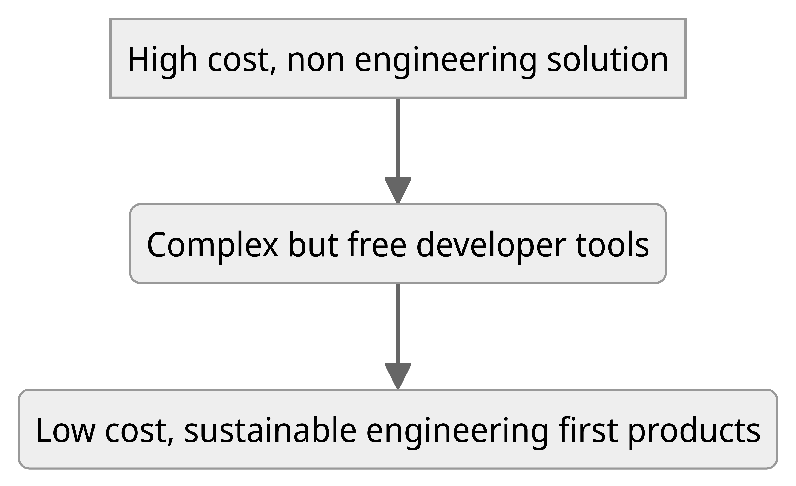

Today, it seems almost everyone is building an AI company or companies that are powered by AI. I never thought I would participate in what we call "The AI Company" bubble.

Seven months ago, when I started [Ploton](https://ploton.dev), I didn’t pay much attention to this because I wanted to avoid the hype and build a product that solves a real, pressing problem and then turn it into a profitable business.

This is because my business fundamentals are very clear: you provide 10x the value for 0.1x the price of the current market. For instance, if you solve a storage problem, create a solution that's 10x better than, say, Dropbox, and charge only 0.1x what Dropbox charges, then see if it’s feasible to build a business around it (meaning going from 0.1x price to 2x price without losing customers, or figuring out more products around it to make a 0.1x deal a 2x Dropbox price deal).

However, after speaking with over 200 businesses and more than 100 CTOs, VPs, and Engineers, it’s clear that there is a dire need for a solid product focused on integrations. Most of the products on the market are nowhere near solving this. In fact, they are the reason engineers have stopped looking for solutions because the integration market is just too full of noise and the prices are insanely high.

In fact, 8 out of 10 companies choose to build integrations in-house. And they are not aware that there could be a better way to handle this. This problem is as significant and as overlooked as the typical authentication problem of the 2010s, where every company was building in-house authentication. They made terrible design mistakes in solving it and often just copied developer tools like "Laravel Passport" or "Passport.js" during the Express.js era, which paved the way for products like Auth0.

The typical cycle of these markets goes like this:

And I believe, in the integrations market, we are at the first intersection where there are products but they have high costs and are not designed for engineers. At Ploton, I am planning to leapfrog this market to the “low cost, engineering-first solution”.

Here is a screenshot of a report from Prismatic to discuss teams engaged in the implementation of current solutions; as you can see, there are almost none on-premise because most of them are not developer tools, and almost none use third-party consultants because it’s not an engineering solution.

But the interesting fact is, this is an engineering problem! It is not a product or business problem. Even if a company is losing sales due to inadequate integrations, it doesn’t make it a non-engineering issue.

Here’s another interesting observation from my research: Three out of five companies work with consultants to solve integration issues, but for them, it’s a non-core problem. For 2 out of 5, it’s a core problem (built on top of multiple integrations) so they choose to build it completely in-house (think fintech companies like durianpay.id).

Therefore, in my journey with Ploton, the developer tool will be a core offering to build in-house integrations, but there is a broad possibility of productizing this "integration as a service" market. Consequently, Ploton’s premium offering will also include "Outsource Integrations to AI." And because I am constantly listening to my users and building it as a developer tool, we are looking at AI to own these integrations as an in-house engineering team. 
